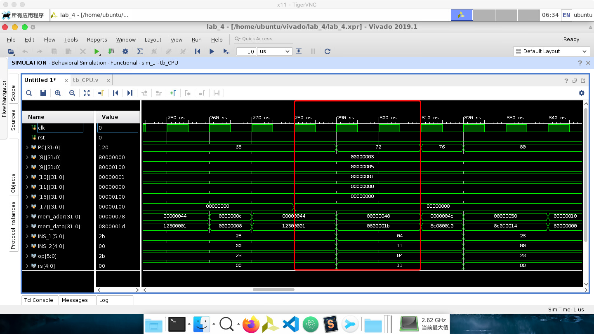

# COD lab 4 summary

by 鸢一折纸

想到哪写到哪

**关于控制单元**

是一个状态机

组合逻辑不要用非阻塞赋值，不然你永远也不知道错在哪里

对于控制信号的赋值会有延迟槽

**关于存储器**

记得地址左移两位从2bit开始取，是以字编码的

m_rf_addr在这里是9位。。。

**关于PC**

PC的刷新使能是PCwe，来自于PCWrite (缘于普通的PC+4，刷新但不执行) 或PCWriteControl且ALUZero (缘于分支跳转指令执行成功)，所以每一条指令只有IF周期PC显示为这一条指令的值，如下框中为BEQ指令的执行区间：

