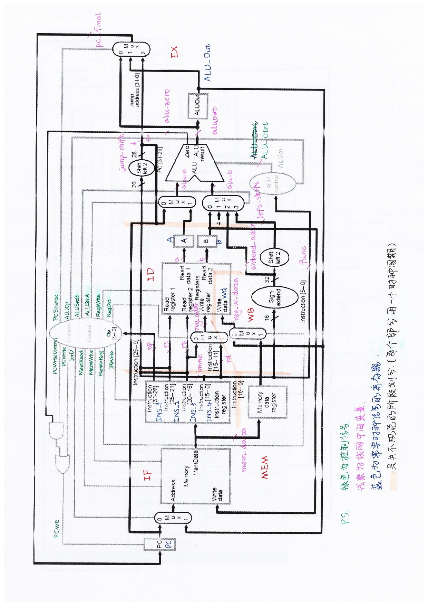

# COD lab 4 summary

by 鸢一折纸

想到哪写到哪

**关于控制单元**

是一个状态机

组合逻辑不要用非阻塞赋值，不然你永远也不知道错在哪里

对于控制信号的赋值会有一丢丢延迟（emm我现在也不知道这句话说的是啥了）

**关于存储器**

记得地址左移两位从2bit开始取，是以字编码的

m_rf_addr在这里是9位。。。

MemRead信号没有用到（因为IP核找不到那个接口）不过问题不大，不影响实验结果正确性

**关于Op Code**

一开始可能会奇怪，在IF的时候还没有译码，控制单元怎么知道怎么赋值呐···事实上Op是从ID才开始影响状态机的跳转，IF必定会跳转到ID呀···而IF阶段 (及其控制信号赋值) 是由上一条指令的最后一个段完成的 (第一个IF由rst决定)

**关于PC**

PC的刷新使能是PCwe，来自于PCWrite (缘于普通的PC+4，刷新但不执行) 或PCWriteControl且ALUZero (缘于分支跳转指令执行成功)，所以每一条指令只有IF周期PC显示为这一条指令的值，如下框中为BEQ指令的执行区间：

可以看到beq指令早就预读取到PC了 (由于没有加MemRead，Mem的读port也被冲的凌乱不堪)，然而由于IRWrite只在每一条指令的IF段有效，所以不会影响后续阶段的控制信号。而分支跳转指令会在自己的completion阶段再次刷新PC，所以也不存在流水线里面延迟槽的问题

**关于ALU的复用**

建议自己走一遍每一个周期的信号，好多地方是时序逻辑，所以我下面这个段划分只是一个参考，并不完全对：

如果有什么问题 (比如最右边那个MUX选择的三个都是啥有啥区别,etc) 可以找我

**关于addi**

需要自行补充，可以参考这个：

