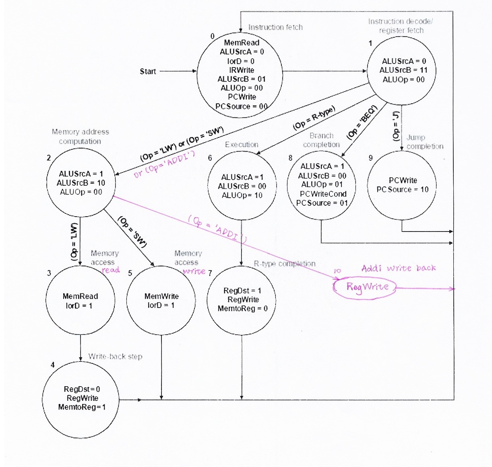
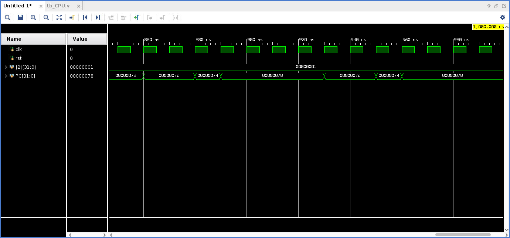

# 组成原理实验报告 Lab 4

<p align="right">PB18000227 艾语晨</p>

<!-- toc -->

- [多周期CPU](#多周期CPU)
	- [实验目标](#实验目标)
	- [实验内容](#实验内容)
		- [多周期CPU](#多周期CPU)
			- [multi_cycle_CPU.v](#Multi_CPU)
			- [Control_Unit.v](#Control_Unit)
			- [MUX.v](#MUX)
			- [Multi_Mux.v](#三、四路选择器)
			- [ALU.v](#ALU)
			- [reg_file.v](#Reg_File)
			- [simulation](#仿真)
		- [DBU](#DBU)
			- [DBU.v](#DBU)
	- [思考题](#思考题)

<!-- tocstop -->

## 多周期CPU

### 实验目标

1. 理解计算机硬件的基本组成、结构和工作原理；
2. 掌握数字系统的设计和调试方法；
3. 熟练掌握数据通路和控制器的设计和描述方法。

### 实验内容

#### 多周期CPU

设计采用普林斯顿结构，数据通路如下图所示


##### Multi_CPU

###### 源代码

```verilog
module multi_CPU
	#(parameter WIDTH = 32)
	(
		input clk, rst
	);

	reg [WIDTH-1:0] PC;
	reg [WIDTH-1:0] A, B;
	reg [5:0] INS_1;						// 31-26 (op)
	reg [4:0] INS_2, INS_3;					// 25-21, 20-16 (rs, rt)
	reg [15:0] INS_4;						// 15-0 (imme)
	reg [2:0] ALU_CTRL;
	reg [WIDTH-1:0] ALU_Out;
	reg [WIDTH-1:0] MEM_data_reg;

	wire [5:0] op;							// 31-26 (op)
	wire [4:0] rs, rt;						// 25-21, 20-16 (rs, rt)
	wire [15:0] imme;						// 15-0 (imme)
	wire [5:0] func;						// 5-0 (func)
	wire [WIDTH-1:0] mem_addr;
	wire [WIDTH-1:0] mem_data;
	wire [4:0] rd;
	wire [WIDTH-1:0] reg_w_data;
	wire [4:0] reg_addr;
	wire [WIDTH-1:0] a, b;
	wire [WIDTH-1:0] extend_addr, left_shift;
	wire [WIDTH-1:0] alu_a, alu_b, alu_out;
	wire alu_zero, cf, of, sf;
	wire [WIDTH-1:0] jump_shift;
	wire [WIDTH-1:0] pc_final;

	assign op = INS_1;
	assign rs = INS_2;
	assign rt = INS_3;
	assign imme = INS_4;
	assign func = imme[5:0];
	// assign a = A;
	// assign b = B;

	// control signal
	wire PCWriteControl, PCWrite, PCwe;
	wire IorD, MemtoReg, RegDst, ALUSrcA;	// ctrl sig for MUX
	wire [1:0] ALUSrcB, ALUOp, PCSource;
	wire [2:0] ALU_ctrl;
	wire MemRead, MemWrite;
	wire IRWrite, RegWrite;

	// IF
	mux MUX_mem_visit (
		.m(IorD),
		.in_0(PC),
		.in_1(ALU_Out),
		.out(mem_addr)
	);

	dist_Memory Memory (
		.a(mem_addr[10:2]),
		.d(B),
		.clk(clk),
		.we(MemWrite),
		.spo(mem_data)
	);

	// ID
	always @(posedge clk) begin
		if (IRWrite) begin
			INS_1 <= mem_data[31:26];
			INS_2 <= mem_data[25:21];
			INS_3 <= mem_data[20:16];
			INS_4 <= mem_data[15:0];
		end
	end

	assign rd = INS_4[15:11];

	mux MUX_reg_read_2 (
		.in_0(rt),
		.in_1(rd),
		.m(RegDst),
		.out(reg_addr)
	);

	reg_file registers (
		.clk(clk),
		.ra0(rs),
		.ra1(rt),
		.wa(reg_addr),
		.rd0(a),
		.rd1(b),
		.we(RegWrite),
		.wd(reg_w_data)
	);

	always @(posedge clk) begin
		A <= a;
		B <= b;
	end

	// sign extend
	assign extend_addr = {((imme[15]) ? 16'hffff : 16'h0000), imme};
	// left shift 2
	assign left_shift = extend_addr << 2;

	// EX
	multi_mux MUX_ALU_B (
		.n(2'd3),
		.m(ALUSrcB),
		.in_0(B),
		.in_1(32'd4),
		.in_2(extend_addr),
		.in_3(left_shift),
		.out(alu_b)
	);

	mux MUX_ALU_A (
		.m(ALUSrcA),
		.in_0(PC),
		.in_1(A),
		.out(alu_a)
	);

	assign PCwe = (PCWriteControl & alu_zero) | PCWrite;
	control_unit control_unit (
		.clk(clk),
		.rst(rst),
		.op(op),
		.PCWriteControl(PCWriteControl),
		.PCWrite(PCWrite),
		.IorD(IorD),
		.MemtoReg(MemtoReg),
		.RegDst(RegDst),
		.ALUSrcA(ALUSrcA),
		.ALUSrcB(ALUSrcB),
		.ALUOp(ALUOp),
		.PCSource(PCSource),
		.MemRead(MemRead),
		.MemWrite(MemWrite),
		.IRWrite(IRWrite),
		.RegWrite(RegWrite)
	);

	// ALU control
	assign ALU_ctrl = ALU_CTRL;
	always @(*) begin
		case (ALUOp)
			2'b00: begin				// LW & SW
				ALU_CTRL = 3'b010;
			end
			2'b01: begin				// BEQ
				ALU_CTRL = 3'b110;
			end
			2'b10: begin				// R-type
				case (func)
					6'b100000: begin	// add
						ALU_CTRL = 3'b010;
					end
					6'b100010: begin	// sub
						ALU_CTRL = 3'b110;
					end
					6'b100100: begin	// and
						ALU_CTRL = 3'b000;
					end
					6'b100101: begin	// or
						ALU_CTRL = 3'b001;
					end
					6'b101010: begin	// slt
						ALU_CTRL = 3'b111;
					end
					default: ALU_CTRL = 'dz;
				endcase
			end
			default: ALU_CTRL = 'dz;
		endcase
	end

	ALU alu (
		.y(alu_out),
		.zf(alu_zero),
		.cf(cf),
		.of(of),
		.sf(sf),
		.a(alu_a),
		.b(alu_b),
		.m(ALU_ctrl)
	);

	always @(posedge clk) begin
		ALU_Out <= alu_out;
	end

	// NPC
	assign jump_shift = {PC[31:28], rs, rt, imme, 2'b00};

	// MEM
	// PC final
	multi_mux MUX_PC (
        .n(2'd2),
		.m(PCSource),
		.in_0(alu_out),
		.in_1(ALU_Out),
		.in_2(jump_shift),
		.out(pc_final)
	);

	always @(posedge clk) begin
		if (rst) begin
			PC <= 32'b0;
		end else begin
			if (PCwe) begin
				PC <= pc_final;
			end
			else
				PC <= PC;			
		end
	end

	always @(posedge clk) begin
		MEM_data_reg <= mem_data;
	end

	// WB
	mux MUX_WB (
		.m(MemtoReg),
		.in_0(ALU_Out),
		.in_1(MEM_data_reg),
		.out(reg_w_data)
	);
endmodule
```

###### 设计思路

多周期CPU相比于单周期CPU，由于一条指令需要多个时钟周期完成，故需要增加寄存器来保存数据，不过由于从ID之后PC就不再改变了，所以不需要像流水线一样添加好多段间寄存器

##### Control_Unit



###### 源代码

```verilog
module control_unit(
	input clk, rst,
	input [5:0] op,
	output reg PCWriteControl, PCWrite,
	output reg lorD, MemtoReg, RegDst, ALUSrcA,	// ctrl sig for MUX
	output reg [1:0] ALUSrcB, ALUOp, PCSource,
	output reg MemRead, MemWrite,
	output reg IRWrite, RegWrite
	);

	parameter [3:0] INSTRUCTION_FETCH = 4'd0;
	parameter [3:0] INSTRUSTION_DECODE_REGISTER_FETCH = 4'd1;
	parameter [3:0] MEMORY_ADDRESS_COMPUTATION = 4'd2;
	parameter [3:0] MEMORY_ACCESS_READ = 4'd3;
	parameter [3:0] WRITE_BACK_STEP = 4'd4;
	parameter [3:0] MEMORY_ACCESS_WRITE = 4'd5;
	parameter [3:0] EXECUTION = 4'd6;
	parameter [3:0] R_TYPE_COMPLETION = 4'd7;
	parameter [3:0] BRANCH_COMPLETION = 4'd8;
	parameter [3:0] JUMP_COMPLETION = 4'd9;
	parameter [3:0] ADDI_WRITE_BACK = 4'd10;

	parameter [2:0] R_TYPE = 3'd0;
	parameter [2:0] LW = 3'd1;
	parameter [2:0] SW = 3'd2;
	parameter [2:0] BEQ = 3'd3;
	parameter [2:0] J_TYPE = 3'd4;
	parameter [2:0] ADDI = 3'd5;

	parameter [2:0] IF = 3'd0;
	parameter [2:0] ID = 3'd1;
	parameter [2:0] EX = 3'd2;
	parameter [2:0] MEM = 3'd3;
	parameter [2:0] WB = 3'd4;

	reg [3:0] curr_state, next_state;
	reg [2:0] ins_type;

	always @(*) begin
		case (op)
			6'b000000: ins_type = R_TYPE;
			6'b100011: ins_type = LW;
			6'b101011: ins_type = SW;
			6'b000100: ins_type = BEQ;
			6'b000010: ins_type = J_TYPE;
			6'b001000: ins_type = ADDI;
			default: ins_type = 'dz;
		endcase
	end

	// FSM
	always @(posedge clk) begin
		if (rst) begin
			curr_state <= INSTRUCTION_FETCH;
		end else begin
			curr_state <= next_state;
		end
	end

	always @(*) begin
		case (curr_state)
			INSTRUCTION_FETCH: next_state = INSTRUSTION_DECODE_REGISTER_FETCH;
			INSTRUSTION_DECODE_REGISTER_FETCH: begin
				case (ins_type)
					R_TYPE: next_state = EXECUTION;
					LW: next_state = MEMORY_ADDRESS_COMPUTATION;
					SW: next_state = MEMORY_ADDRESS_COMPUTATION;
					BEQ: next_state = BRANCH_COMPLETION;
					J_TYPE: next_state = JUMP_COMPLETION;
					ADDI: next_state = MEMORY_ADDRESS_COMPUTATION;
					default: next_state = 'dz;
				endcase
			end
			MEMORY_ADDRESS_COMPUTATION: begin
				if (ins_type == LW) begin
					next_state = MEMORY_ACCESS_READ;
				end
				else if (ins_type == SW) begin
					next_state = MEMORY_ACCESS_WRITE;
				end
				else begin										// addi
					next_state = ADDI_WRITE_BACK;
				end
			end
			MEMORY_ACCESS_READ: next_state = WRITE_BACK_STEP;
			WRITE_BACK_STEP: next_state = INSTRUCTION_FETCH;
			MEMORY_ACCESS_WRITE: next_state = INSTRUCTION_FETCH;
			EXECUTION: next_state = R_TYPE_COMPLETION;
			R_TYPE_COMPLETION: next_state = INSTRUCTION_FETCH;
			BRANCH_COMPLETION: next_state = INSTRUCTION_FETCH;
			JUMP_COMPLETION: next_state = INSTRUCTION_FETCH;
			ADDI_WRITE_BACK: next_state = INSTRUCTION_FETCH;
			default: next_state = 'dz;
		endcase
	end

	// ctrl sig
	always @(*) begin
		{PCWriteControl, PCWrite, lorD, MemRead, MemWrite, MemtoReg, IRWrite, PCSource, ALUOp, ALUSrcB, ALUSrcA, RegWrite, RegDst} = 16'b0;
		case (curr_state)
			INSTRUCTION_FETCH: begin
				MemRead = 1;
				IRWrite = 1;
				ALUSrcB = 2'b01;
				PCWrite = 1;
			end
			INSTRUSTION_DECODE_REGISTER_FETCH: begin
				ALUSrcB = 2'b11;
			end
			MEMORY_ADDRESS_COMPUTATION: begin
				ALUSrcA = 1;
				ALUSrcB = 2'b10;
			end
			MEMORY_ACCESS_READ: begin
				MemRead = 1;
				lorD = 1;
			end
			WRITE_BACK_STEP: begin
				RegWrite = 1;
				MemtoReg = 1;
			end
			MEMORY_ACCESS_WRITE: begin
				MemWrite = 1;
				lorD = 1;
			end
			EXECUTION: begin
				ALUSrcA = 1;
				ALUOp = 2'b10;
			end
			R_TYPE_COMPLETION: begin
				RegDst = 1;
				RegWrite = 1;
			end
			BRANCH_COMPLETION: begin
				ALUSrcA = 1;
				ALUOp = 2'b01;
				PCWriteControl = 1;
				PCSource = 2'b01;
			end
			JUMP_COMPLETION: begin
				PCWrite = 1;
				PCSource = 2'b10;
			end
			ADDI_WRITE_BACK: begin
				RegWrite = 1;
			end
			default: {PCWriteControl, PCWrite, lorD, MemRead, MemWrite, MemtoReg, IRWrite, PCSource, ALUOp, ALUSrcB, ALUSrcA, RegWrite, RegDst} = 'dz;
		endcase
	end
endmodule
```

###### 设计思路

参考PPT里面的状态机跳转图，采用三段式设计

##### MUX

```verilog
module mux
#(parameter WIDTH = 32)
(
	input m, // control signal
	input [WIDTH-1:0] in_0,in_1,
	output [WIDTH-1:0] out
);
	assign out = (m == 1'b0 ? in_0 : in_1);

endmodule // mux
```

##### 三/四路选择器

###### 源代码

```verilog
module multi_mux
	#(parameter WIDTH = 32)
	(
        input [1:0] n,			// select depth, from 2~3
		input [1:0] m,			// control signal
		input [WIDTH-1:0] in_0, in_1, in_2, in_3,
		output reg [WIDTH-1:0] out
	);

	always @(*) begin
		case (m)
			2'b00: out = in_0;
			2'b01: out = in_1;
			2'b10: out = in_2;
			2'b11: out = (n == 2'd2) ? 'dz : in_3;
			default: out = 'dz;
		endcase
	end
endmodule
```

###### 设计思路

n为选择路数-1，当n为2 (三选一) 时第四个端口为高阻态

##### ALU

```verilog
// on basis of the COD 5th edition, we use the following parameters
module ALU
    #(parameter WIDTH = 32) 	// data width
(
    output reg [WIDTH-1:0] y,   // calculation result
    output reg zf,              // zero sign
    output reg cf,              // jinwei sign
	output reg of,				// yichu
	output reg sf,				// for signed cal
	input [WIDTH-1:0] a,
	input [WIDTH-1:0] b,
	input [2:0] m				// type
);

	localparam ADD = 3'b010;
    localparam SUBTRACT = 3'b110;
    localparam AND = 3'b000;
    localparam OR = 3'b001;
    localparam XOR = 3'b100;
    localparam SLT = 3'b111;

    always @(*) begin
		{zf,of,cf,sf} = 4'b0000;
		case (m)
			ADD:  begin
				{cf, y} = a + b;
				of = (~a[WIDTH-1] & ~b[WIDTH-1] & y[WIDTH-1]) | (a[WIDTH-1] & b[WIDTH-1] & ~y[WIDTH-1]);
				zf = ~|y;
			end
			SUBTRACT: begin
				{cf, y} = a - b;
				of = (~a[WIDTH-1] & b[WIDTH-1] & y[WIDTH-1]) | (a[WIDTH-1] & ~b[WIDTH-1] & ~y[WIDTH-1]);
				zf = ~|y;
				sf = y[WIDTH-1];
			end
			AND: begin
				y = a & b;
				zf = ~|y;
				sf = y[WIDTH-1];
			end
			OR: begin
				y = a | b;
				zf = ~|y;
				sf = y[WIDTH-1];
			end
			XOR: begin
				y = a ^ b;
				zf = ~|y;
				sf = y[WIDTH-1];
			end
            SLT: begin
                y = (a < b) ? 32'b1 : 32'b0;
            end
			default: y = a;
		endcase
	end
endmodule
```

##### Reg_File

```verilog
module reg_file
	#(parameter WIDTH = 32)
	(
		input clk,
		input [4:0] ra0,			// read port 0 addr
		output [WIDTH-1:0] rd0,		// read port 0 data
		input [4:0] ra1,			// read port 1 addr
		output [WIDTH-1:0] rd1,		// read port 1 data
		input [4:0] wa,				// write port addr
		input we,					// write enable, valid at '1'
		input [WIDTH-1:0] wd		// write port data
	);

	reg [WIDTH-1:0] reg_file [0:31];

	assign rd0 = reg_file[ra0];
	assign rd1 = reg_file[ra1];

	integer i;						// loop varible
	initial begin
		for (i = 0; i < 32; i = i + 1) begin
			reg_file [i] = 0;
		end
	end

	always @(posedge clk) begin
		if (we && wa != 4'b0) begin
			reg_file[wa] <= wd;
		end
	end
endmodule
```

##### 仿真

###### 仿真代码

```verilog
module tb_CPU;
    reg clk, rst;

    multi_CPU cpu (
        .clk(clk),
        .rst(rst)
    );

    initial
    begin
        clk = 1;
        rst = 1;
        # 10 rst = 0;
        # 990 $finish;
    end

    always
    # 5 clk = ~clk;
endmodule
```

###### 波形

> `[2]`是存储器0x08



#### DBU

##### DBU

```verilog
module DBU
	# (parameter WIDTH = 32)
	(
		input clk, rst,
		input succ,				// control CPU running type
		input step,
		input [2:0] sel,		// overview the result or status of CPU, 0 for result
		// when examining CPU result
		input m_rf,				// 1 for MEM, 0 for RF (Reg_File)
		input inc,				// m_rf_addr ++
		input dec,				// m_rf_addr --
		output reg [15:0] led,
		output [7:0] an,		// anode, choose which SEG shines
		output [7:0] seg		// node
	);

	wire [11:0] status;
	wire [WIDTH-1:0] m_data;
	wire [WIDTH-1:0] rf_data;
	wire [WIDTH-1:0] selected_data;
	wire step_clean, step_edge;
	wire inc_clean, inc_edge;
	wire dec_clean, dec_edge;
	wire [WIDTH-1:0] display_data;

	reg run;
	reg [8:0] m_rf_addr;

	multi_CPU cpu (
		.clk(clk),
		.rst(rst),
		.run(run),
		.m_rf_addr(m_rf_addr),
		.sel(sel),
		.status(status),
		.m_data(m_data),
		.rf_data(rf_data),
		.selected_data(selected_data)
	);

	jitter_clr step_clr (
		.clk(clk),
		.button(step),
		.button_clean(step_clean)
	);

	signal_edge step_ed (
		.clk(clk),
		.button(step_clean),
		.button_edge(step_edge)
	);

	jitter_clr inc_clr (
		.clk(clk),
		.button(inc),
		.button_clean(inc_clean)
	);

	signal_edge inc_ed (
		.clk(clk),
		.button(inc_clean),
		.button_edge(inc_edge)
	);

	jitter_clr dec_clr (
		.clk(clk),
		.button(dec),
		.button_clean(dec_clean)
	);

	signal_edge dec_ed (
		.clk(clk),
		.button(dec_clean),
		.button_edge(dec_edge)
	);

	// run
	always @(posedge clk) begin
		if (succ) begin
			run = 1;
		end else begin
			if (step_edge) begin
				run = 1;
			end else begin
				run = 0;
			end
		end
	end

	assign display_data = m_rf ? m_data : rf_data;

	SegDis #(WIDTH) Seg_Dis (
		.clk(clk),
		.rst(rst),
		.data(display_data),
		.an(an),
		.seg(seg)
	);
	
	// led : m_rf_addr
	initial
	begin
		led = 16'b0;
	end
	always @(posedge clk) begin
		led = 16'h0;
		if (sel == 3'b0) begin
			led = {7'b0, m_rf_addr};
		end
		else begin
			led = {4'b0, status};
		end
	end

	always @(posedge clk) begin
		if (rst) begin
			m_rf_addr = 0;
		end
		else begin
			if (inc_edge) begin
				m_rf_addr = m_rf_addr + 1;
			end
			else if (dec_edge) begin
				m_rf_addr = m_rf_addr - 1;
			end
			else begin
				m_rf_addr = m_rf_addr;
			end
		end
	end
endmodule
```

##### 其他模块

去抖动、取边沿、分时复用、数码管代码

###### 去抖动

```verilog
module jitter_clr(
	input clk,
	input button,
	output button_clean
	);

	reg [3:0] cnt;

	always @(posedge clk) begin
		if (button == 1'b0) begin
			cnt <= 4'h0;
		end
		else if (cnt < 4'h8) begin
			cnt <= cnt + 1'b1;
		end
	end
endmodule
```

###### 取边沿

```verilog
module signal_edge(
	input clk,
	input button,
	output button_edge
	);

	reg button_r1, button_r2;

	always @(posedge clk) begin
		button_r1 <= button;
	end

	always @(posedge clk) begin
		button_r2 <= button_r1;
	end

	assign button_edge = button_r1 & ~button_r2;
endmodule
```

###### 分时复用

```verilog
module counter(
	input clk, rst,
	output reg [2:0] scan_cnt
	);

	reg [17:0] cnt;
	// reg [2:0] scan_cnt;

	wire pulse;

	always @(posedge clk) begin
		if (rst) begin
			cnt <= 18'h0;
		end
		else if (cnt == 18'd10000) begin
			cnt <= 18'b0;
		end
		else begin
			cnt <= cnt + 18'b1;
		end
	end

	assign pulse = (cnt == 18'd10000) ? 1'b1 : 1'b0;

	always @(posedge clk) begin
		if (rst) begin
			scan_cnt <= 3'b0;
		end
		else if (pulse) begin
			scan_cnt <= scan_cnt + 3'b1;
		end
	end
endmodule
```

###### 数码管

```verilog
module SegDis
	#(parameter WIDTH = 32)
	(
		input clk,rst,
		input [WIDTH-1:0] data,
		output reg [7:0] an,
		output [7:0] seg
	);

	wire [2:0] scan_cnt;

	reg [WIDTH-1:0] show_data;

	counter clk_1KHz (
		.clk(clk),
		.rst(rst),
		.scan_cnt(scan_cnt)
	);

	initial
	begin
		an = 8'b0;
		show_data = 32'b0;
	end

	always @(posedge clk) begin
		case (scan_cnt)
			3'h0: an <= 8'b1111_1110;
			3'h1: an <= 8'b1111_1101;
			3'h2: an <= 8'b1111_1011;
			3'h3: an <= 8'b1111_0111;
			3'h4: an <= 8'b1110_1111;
			3'h5: an <= 8'b1101_1111;
			3'h6: an <= 8'b1011_1111;
			3'h7: an <= 8'b0111_1111;
			default: an <= 'dz;
		endcase
	end

	always @(posedge clk) begin
		case (scan_cnt)
			3'h0: show_data <= data[3:0];
			3'h1: show_data <= data[7:4];
			3'h2: show_data <= data[11:8];
			3'h3: show_data <= data[15:12];
			3'h4: show_data <= data[19:16];
			3'h5: show_data <= data[23:20];
			3'h6: show_data <= data[27:24];
			3'h7: show_data <= data[31:28];
			default: show_data <= 'dz;
		endcase
	end

	dist_seg_dis_decode decode (
		.a(show_data),
		.spo(seg)
	);
endmodule
```

### 思考题

##### 修改数据通路和控制器，扩展对其他MIPS指令的支持，并进行功能仿真和下载测试

对`sub, and, or, slt` (R-type) 指令只需修改ALU和ALU控制单元，已在上述代码中呈现