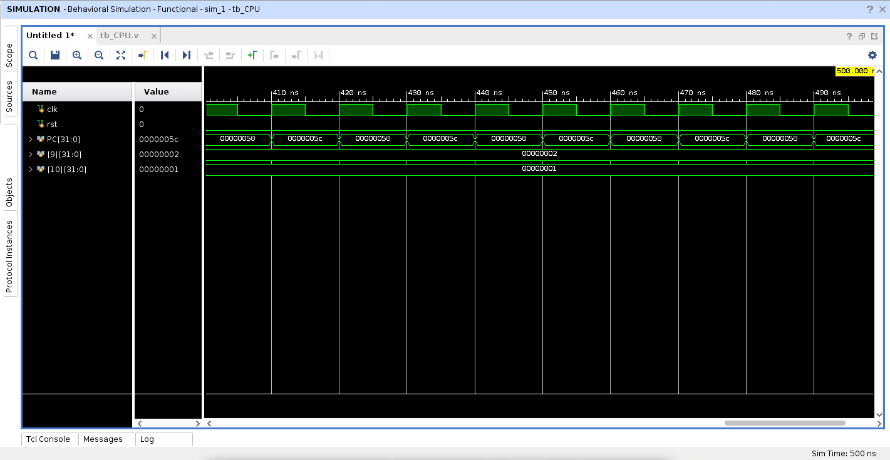
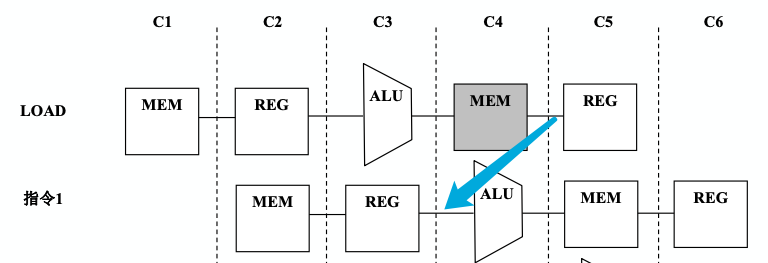
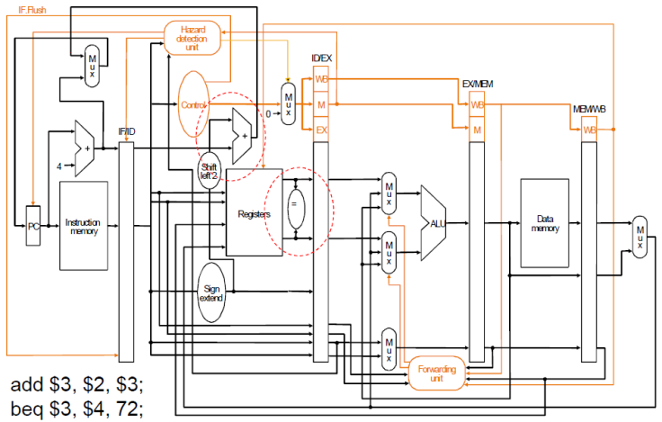
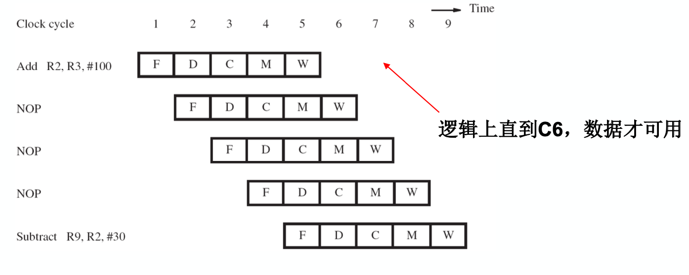
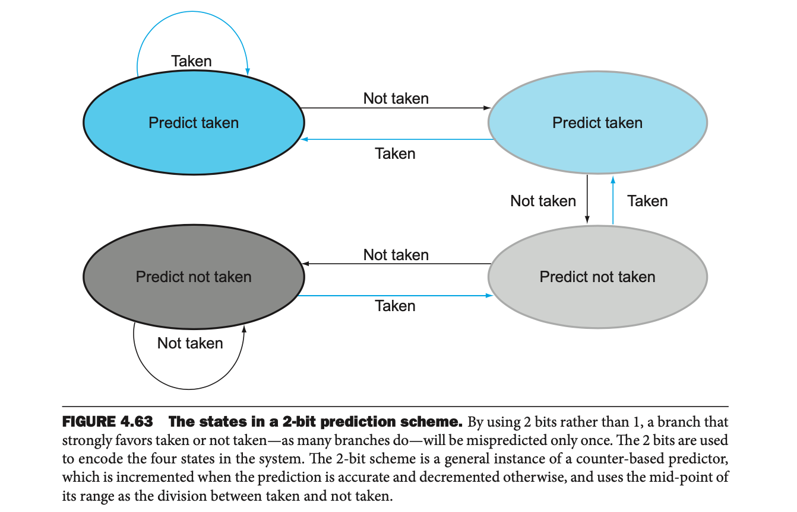
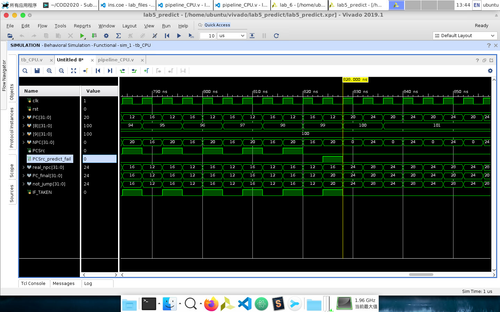
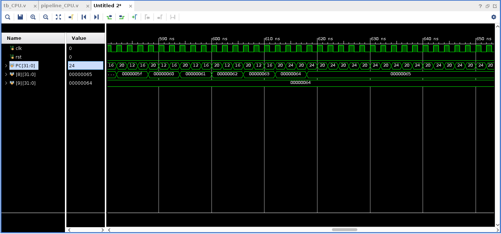

# 组成原理实验报告 Lab 5

<p align="right">PB18000227 艾语晨</p>

<!-- toc -->

- [流水线CPU](#流水线CPU)
	- [实验目标](#实验目标)
	- [实验内容](#实验内容)
		- [流水线CPU](#流水线CPU)
			- [pipeline_CPU.v](#Pipeline_CPU)
			- [reg_file.v](#Reg_File)
			- [MUX.v](#MUX)
			- [Multi_Mux.v](#三、四路选择器)
			- [ALU.v](#ALU)
			- [simulation](#Simulation)
	- [思考题](#思考题)
		- [静态分支预测](#静态分支预测)
		- [动态分支预测](#动态分支预测)
		- [动态分支预测代码](#动态分支预测代码)
			- [完整的CPU代码](#完整的CPU代码)
			- [预测单元](#预测单元)
			- [主要的代码分析](#主要的代码分析)

<!-- tocstop -->

## 流水线CPU

### 实验目标

1. 理解流水线CPU的组成结构和工作原理；
2. 掌握数字系统的设计和调试方法；
3. 熟练掌握数据通路和控制器的设计和描述方法。

### 实验内容

#### CPU实现代码

##### Pipeline_CPU

```verilog
module pipeline_CPU
	#(parameter WIDTH = 32)
	(
		input clk, rst
	);

	localparam [5:0] R_TYPE = 6'b000000;
	localparam [5:0] LW = 6'b100011;
	localparam [5:0] SW = 6'b101011;
	localparam [5:0] BEQ = 6'b000100;
	localparam [5:0] J_TYPE = 6'b000010;
	localparam [2:0] ADDI = 6'b001000;

	reg [WIDTH-1:0] NPC, IR;					// IF/ID inter-stages register
	reg [WIDTH-1:0] A, B, IMM, RS, RT, RD;		// ID/EX inter-stages register
	// WAE for WB_address_from_EX_stage
	reg [WIDTH-1:0] ALUOut, WMD;				// EX/MEM inter-stages register
	reg [4:0] WAE;								// EX/MEM inter-stages register
	// MDR for mem_data_reg, ADR for ALUout_data_reg, WAM for WB_address_from_MEM_stage
	reg [WIDTH-1:0] MDR, ADR;					// MEM/WB inter-stages register
	reg [4:0] WAM;								// MEM/WB inter-stages register
	reg [WIDTH-1:0] PC;

	wire [WIDTH-1:0] npc;						// PC+4, IF stage
	wire [WIDTH-1:0] ir;						// output of Instruction Mem, IF stage
	wire [WIDTH-1:0] shift_left, pc_beq;		// BEQ addr, ID stage
	wire [WIDTH-1:0] jump_addr;					// JUMP addr, ID stage
	wire [WIDTH-1:0] not_jump, PC_final;		// Branch complete, ID stage
	wire [9:0] haz;								// IR for Hazard Detection Unit, ID stage
	wire [5:0] op;								// IR for Control Unit, ID stage
	wire [WIDTH-1:0] extend;					// Sign extended imme, ID stage
	wire [WIDTH-1:0] a, b;						// register file read ports, ID stage
	wire [15:0] beq_forward;					// containing op, rs, rt infro, used in Forwarding Unit, ID stage
	wire [WIDTH-1:0] addr_imme;					// the same as 'extend', EX stage
	wire [4:0] rs, rt, rd;						// ID fragments, EX stage
	wire [5:0] func;							// for ALU Control Unit, EX stage
	wire [WIDTH-1:0] alu_a, alu_b, alu_result;	// ALU input/output, EX stage
	wire ALU_Zero, cf, of, sf;					// for unused ports of ALU, EX stage
	wire [WIDTH-1:0] final_b;
	wire [4:0] rw_addr;							// chosen register write addr, EX stage
	wire [WIDTH-1:0] mem_out;					// MEM_IP out, MEM_stage
	wire [WIDTH-1:0] reg_data;					// WB stage
	wire [4:0] reg_addr;						// WB stage

	// Control Signals, definations & inter-stages
	reg [1:0] ALUOp, ForwardA, ForwardB, ALU_MUX;
	reg [2:0] ALU_Ctrl, ForwardReg;
	reg PCwe;									// the Boss PC Write control, IF stage
	reg RegDst, AluSrc, MemRead, MemWrite, MemtoReg, RegWrite;
	reg Branch, Jump;
	reg PCWrite, FDWrite, ControlFlush, IFFlush;
	reg [1:0] ALUOp_DE;
	reg AluSrc_DE, RegDst_DE, MemRead_DE, MemWrite_DE, MemtoReg_DE, RegWrite_DE;
	reg MemRead_EM, MemWrite_EM, MemtoReg_EM, RegWrite_EM;
	reg MemtoReg_MW, RegWrite_MW;

	// Control Signals, in use, assigned from stage_regs
	wire Zero, PCSrc;

	assign op = IR[31:26];
	assign haz = IR[25:16];
	assign extend = {((IR[15]) ? 16'hffff : 16'h0000), IR[15:0]};
	assign beq_forward = IR[31:16];
	assign rs = RS;
	assign rt = RT;
	assign rd = RD;
	assign addr_imme = IMM;
	assign reg_addr = WAM;

	// IF
	always @(posedge clk) begin
		if (rst) begin
			PC <= 0;
		end
		else if (PCwe) begin
			PC <= PC_final;
		end
		else
			PC <= PC;
	end

	assign npc = PC + 4;

	mux MUX_BEQ (
		.m(PCSrc),
		.in_0(npc),
		.in_1(pc_beq),
		.out(not_jump)
	);

	mux MUX_JUMP (
		.m(Jump),
		.in_0(not_jump),
		.in_1(jump_addr),
		.out(PC_final)
	);

	dist_inst_rom instruction (
		.a(PC[9:2]),
		.spo(ir)
	);

	// IF/ID inter-stages registers
	always @(posedge clk) begin
		if (IFFlush) begin
			NPC <= 0;
			IR <= 0;
		end
		else begin
			if (FDWrite) begin
				NPC <= npc;
				IR <= ir;
			end
			else begin
				NPC <= NPC;
				IR <= IR;
			end
		end
	end

	// ID
	reg_file registers (
		.clk(clk),
		.forward(ForwardReg),
		.ex(alu_result),
		.mem(mem_out),
		.ra0(IR[25:21]),
		.ra1(IR[20:16]),
		.rd0(a),
		.rd1(b),
		.wa(reg_addr),
		.wd(reg_data),
		.we(RegWrite_MW)
	);

	// for BEQ and Jump
	assign Zero = (a == b) ? 1'b1 : 1'b0;
	assign shift_left = extend << 2;
	assign pc_beq = shift_left + NPC;
	assign jump_addr = {NPC[31:28], IR[25:0], 2'b00};

	// Control Unit
	always @(posedge clk) begin
		if (rst) begin
			{RegDst, Jump, Branch, MemRead, MemtoReg, RegWrite, MemWrite, ALUOp, IFFlush, AluSrc, ForwardReg} = 0;
		end
	end

	always @(*) begin
		{RegDst, Jump, Branch, MemRead, MemtoReg, RegWrite, MemWrite, ALUOp, AluSrc} = 0;
		case (op)
			6'b000000: begin					// R-type
				RegDst = 1'b1;
				RegWrite = 1'b1;
				ALUOp = 2'b10;
			end
			6'b100011: begin					// lw
				AluSrc = 1'b1;
				MemtoReg = 1'b1;
				RegWrite = 1'b1;
				MemRead = 1'b1;
			end
			6'b101011: begin					// sw
				AluSrc = 1'b1;
				MemWrite = 1'b1;
			end
			6'b000100: begin					// beq
				Branch = 1'b1;
				ALUOp = 2'b01;
			end
			6'b001000: begin					// addi
				AluSrc = 1'b1;
				RegWrite = 1'b1;
			end
			6'b000010: begin					// Jump
				Jump = 1'b1;
			end
			default: {RegDst, Jump, Branch, MemRead, MemtoReg, RegWrite, MemWrite, ALUOp, AluSrc} = 'dz;
		endcase
	end

	// Hazard Detection Unit
	// consider R-type, BEQ, BNE, SW at ID
	// Priority considered
	assign PCSrc = Zero & Branch;
	always @(*) begin
		// no need to stall when BEQ is right after a non-mem-visiting instruction,
		// since forwarding from EX result to ID is done (might decrease clk rate)
		if ((op == BEQ) && (MemRead_DE && ((rt == haz[4:0]) || (rt == haz[9:5])))) begin
			// LW + BEQ hazard, BEQ at ID, stall 1 cycle
			PCWrite = 0;
			PCwe = 0;
			IFFlush = 0;
			FDWrite = 0;
			ControlFlush = 1;
		end
		// Jump or Branch success, clear PC and IF/ID inter-stages registers
		else if (Jump || PCSrc) begin
			PCWrite = 1;						// low priority
			PCwe = 1;
			IFFlush = 1;
			FDWrite = 0;						// low priority, 0 or 1 both are ok
			ControlFlush = 0;					// since BEQ/JUMP do not have latter stages, 0 or 1 both are ok
		end
		// R-type or SW need to be considered since they need rt as operation source
		else if (MemRead_DE && (((rt == haz[4:0]) && ((op == 6'b00000) || (op == 6'b101011))) || (rt == haz[9:5]))) begin
			PCWrite = 0;
			PCwe = 0;
			IFFlush = 0;
			FDWrite = 0;
			ControlFlush = 1;
		end
		else begin
			PCWrite = 1;
			PCwe = 1;
			IFFlush = 0;
			FDWrite = 1;
			ControlFlush = 0;
		end
	end

	// ID/EX inter-stages registers
	// in order to avoid possible data impact, I put all data to 'dz if this reg_pile is set clear
	always @(posedge clk) begin
		if (~IFFlush && ~ControlFlush) begin
			A <= a;
			B <= b;
			RS <= IR[25:21];
			RT <= IR[20:16];
			RD <= IR[15:11];
			RegDst_DE <= RegDst;
			ALUOp_DE <= ALUOp;
			MemRead_DE <= MemRead;
			MemtoReg_DE <= MemtoReg;
			MemWrite_DE <= MemWrite;
			RegWrite_DE <= RegWrite;
			AluSrc_DE <= AluSrc;
			IMM <= extend;
		end
		else begin
			{A, B, RS, RT, RD, IMM} <= 'dz;
			{RegDst_DE, MemRead_DE, MemtoReg_DE, RegWrite_DE, MemWrite_DE, ALUOp_DE, AluSrc_DE} <= 0;
		end
	end

	// EX
	multi_mux MUX_ALU_A (
		.n(2'd2),
		.m(ForwardA),
		.in_0(A),
		.in_1(reg_data),
		.in_2(ALUOut),
		.out(alu_a)
	);

	multi_mux MUX_FINAL_B (
		.n(2'd2),
		.m(ForwardB),
		.in_0(B),
		.in_1(reg_data),
		.in_2(ALUOut),
		.out(final_b)
	);

	assign addr_imme = IMM;
	assign func = IMM[5:0];

	mux MUX_ALU_B (
		.m(AluSrc_DE),
		.in_0(final_b),
		.in_1(IMM),
		.out(alu_b)
	);

	// ALU Control Unit
	always @(*) begin
		case (ALUOp_DE)
			2'b00: begin				// LW & SW
				ALU_Ctrl = 3'b010;
			end
			2'b01: begin				// BEQ
				ALU_Ctrl = 3'b110;
			end
			2'b10: begin				// R-type
				case (func)
					6'b100000: begin	// add
						ALU_Ctrl = 3'b010;
					end
					6'b100010: begin	// sub
						ALU_Ctrl = 3'b110;
					end
					6'b100100: begin	// and
						ALU_Ctrl = 3'b000;
					end
					6'b100101: begin	// or
						ALU_Ctrl = 3'b001;
					end
					6'b101010: begin	// slt
						ALU_Ctrl = 3'b111;
					end
					default: ALU_Ctrl = 'dz;
				endcase
			end
			default: ALU_Ctrl = 'dz;
		endcase
	end

	ALU alu (
		.y(alu_result),
		.zf(ALU_Zero),
		.cf(cf),
		.of(of),
		.sf(sf),
		.a(alu_a),
		.b(alu_b),
		.m(ALU_Ctrl)
	);

	mux MUX_REGDST (
		.m(RegDst_DE),
		.in_0(rt),
		.in_1(rd),
		.out(rw_addr)
	);

	// Forwarding Unit
	// NOT solved WB-start to MEM-start
	// solved WB-start or MEM-start to EX-start
	// For ForwardReg: MEM-start (EX result) or MEM-end (MEM result) to ID
	// 000 for non-forwarding, 001 from ALU to A, 010 from ALU to B,
	// 011 from MEM to A, 100 from MEM to B
	always @(*) begin
		// forward to EX-start
		if (RegWrite_EM && (|WAE) && (WAE == rs)) begin
			ForwardA = 2'b10;			
		end
		else if (RegWrite_MW && (|WAM) && (WAM == rs)) begin
			ForwardA = 2'b01;
		end
		else begin
			ForwardA = 2'b00;
		end
	end

	always @(*) begin
		// forward to EX-start
		if (RegWrite_EM && (|WAE) && (WAE == rt)) begin
			ForwardB = 2'b10;
		end
		else if (RegWrite_MW && (|WAM) && (WAM == rt)) begin
			ForwardB = 2'b01;
		end
		else begin
			ForwardB = 2'b00;
		end
	end

	always @(*) begin
		// current instruction in ID is a BEQ
		if (beq_forward[15:10] == 6'b000100) begin
			if (RegWrite_DE && (|rw_addr) && (rw_addr == beq_forward[9:5])) begin
				ForwardReg = 3'b001;
			end
			else if (RegWrite_DE && (|rw_addr) && (rw_addr == beq_forward[4:0])) begin
				ForwardReg = 3'b010;
			end
			else if (RegWrite_EM && (|WAE) && (WAE == beq_forward[9:5])) begin
				ForwardReg = 3'b011;
			end
			else if (RegWrite_EM && (|WAE) && (WAE == beq_forward[4:0])) begin
				ForwardReg = 3'b100;
			end
			else begin
				ForwardReg = 3'b000;
			end
		end
		else begin
			ForwardReg = 3'b000;
		end
	end

	// EX/MEM inter-stages registers
	always @(posedge clk) begin
		ALUOut <= alu_result;
		WMD <= final_b;
		WAE <= rw_addr;
		MemRead_EM <= MemRead_DE;
		MemWrite_EM <= MemWrite_DE;
		MemtoReg_EM <= MemtoReg_DE;
		RegWrite_EM <= RegWrite_DE;
	end

	// MEM
	dist_data_ram memory (
		.a(ALUOut[9:2]),
		.d(WMD),
		.clk(clk),
		.we(MemWrite_EM),
		.spo(mem_out)
	);

	// MEM/WB inter-stages registers
	always @(posedge clk) begin
		MDR <= mem_out;
		ADR <= ALUOut;
		WAM <= WAE;
		MemtoReg_MW <= MemtoReg_EM;
		RegWrite_MW <= RegWrite_EM;
	end

	// WB
	mux MUX_WB (
		.m(MemtoReg_MW),
		.in_0(ADR),
		.in_1(MDR),
		.out(reg_data)
	);
endmodule
```

##### Reg_File

```verilog
// Containing inner-forwarding
module reg_file
	#(parameter WIDTH = 32)
	(
		input clk,
		input [2:0] forward,		// 000 for non-forwarding, 001 from ALU to A, 010 from ALU to B, 011 from MEM to A, 100 from MEM to B
		input [WIDTH-1:0] ex,		// input data from ALU-result
		input [WIDTH-1:0] mem,		// input data from mem-visit-result
		input [4:0] ra0,			// read port 0 addr
		output reg [WIDTH-1:0] rd0,	// read port 0 data
		input [4:0] ra1,			// read port 1 addr
		output reg [WIDTH-1:0] rd1,	// read port 1 data
		input [4:0] wa,				// write port addr
		input we,					// write enable, valid at '1'
		input [WIDTH-1:0] wd		// write port data
	);

	reg [WIDTH-1:0] reg_file [0:31];

	always @(*) begin
		case (forward)
			// not outside forwarding, consider inner-register forwarding (WB->ID)
			3'b000: begin
				if ((wa == ra0) && (|wa) && we) begin
					rd0 = wd;
					rd1 = reg_file[ra1];
				end
				else if ((wa == ra1) && (|wa) && we) begin
					rd0 = reg_file[ra0];
					rd1 = wd;
				end
				else begin
					rd0 = reg_file[ra0];
					rd1 = reg_file[ra1];
				end
			end
			// forward from EX, since a ALU result is needed
			3'b001: begin
				rd0 = ex;
				if ((wa == ra1) && (|wa) && we) begin
					rd1 = wd;
				end
				else begin
					rd1 = reg_file[ra1];
				end
			end
			3'b010: begin
				if ((wa == ra0) && (|wa) && we) begin
					rd0 = wd;
				end
				else begin
					rd0 = reg_file[ra0];
				end
				rd1 = ex;
			end
			3'b011: begin
				rd0 = mem;
				if ((wa == ra1) && (|wa) && we) begin
					rd1 = wd;
				end else begin
					rd1 = reg_file[ra1];
				end
			end
			3'b100: begin
				if ((wa == ra0) && (|wa) && we) begin
					rd0 = wd;
				end else begin
					rd0 = reg_file[ra0];
				end
				rd1 = mem;
			end
			default: begin
				rd0 = 'dz;
				rd1 = 'dz;
			end
		endcase
	end

	integer i;						// loop varible
	initial begin
		for (i = 0; i < 32; i = i + 1) begin
			reg_file [i] = 0;
		end
	end

	always @(posedge clk) begin
		if (we && wa != 4'b0) begin
			reg_file[wa] <= wd;
		end
	end
endmodule
```

##### MUX

```verilog
module mux
#(parameter WIDTH = 32)
(
	input m, // control signal
	input [WIDTH-1:0] in_0,in_1,
	output [WIDTH-1:0] out
);
	assign out = (m == 1'b0 ? in_0 : in_1);

endmodule // mux
```

##### 三、四路选择器

```verilog
module multi_mux
	#(parameter WIDTH = 32)
	(
		input [1:0] n,			// select depth, from 0~3
		input [1:0] m,			// control signal
		input [WIDTH-1:0] in_0, in_1, in_2, in_3,
		output reg [WIDTH-1:0] out
	);

	always @(*) begin
		case (m)
			2'b00: out = in_0;
			2'b01: out = in_1;
			2'b10: out = in_2;
			2'b11: out = (n == 2'd2) ? 'dz : in_3;
			default: out = 'dz;
		endcase
	end
endmodule
```

##### ALU

```verilog
// on basis of the COD 5th edition, we use the following parameters
module ALU
    #(parameter WIDTH = 32) 	// data width
(
    output reg [WIDTH-1:0] y,   // calculation result
    output reg zf,              // zero sign
    output reg cf,              // jinwei sign
	output reg of,				// yichu
	output reg sf,				// for signed cal
	input [WIDTH-1:0] a,
	input [WIDTH-1:0] b,
	input [2:0] m				// type
);

	localparam ADD = 3'b010;
    localparam SUBTRACT = 3'b110;
    localparam AND = 3'b000;
    localparam OR = 3'b001;
    localparam XOR = 3'b100;
    localparam SLT = 3'b111;

    always @(*) begin
		{zf,of,cf,sf} = 4'b0000;
		case (m)
			ADD:  begin
				{cf, y} = a + b;
				of = (~a[WIDTH-1] & ~b[WIDTH-1] & y[WIDTH-1]) | (a[WIDTH-1] & b[WIDTH-1] & ~y[WIDTH-1]);
				zf = ~|y;
			end
			SUBTRACT: begin
				{cf, y} = a - b;
				of = (~a[WIDTH-1] & b[WIDTH-1] & y[WIDTH-1]) | (a[WIDTH-1] & ~b[WIDTH-1] & ~y[WIDTH-1]);
				zf = ~|y;
				sf = y[WIDTH-1];
			end
			AND: begin
				y = a & b;
				zf = ~|y;
				sf = y[WIDTH-1];
			end
			OR: begin
				y = a | b;
				zf = ~|y;
				sf = y[WIDTH-1];
			end
			XOR: begin
				y = a ^ b;
				zf = ~|y;
				sf = y[WIDTH-1];
			end
            SLT: begin
                y = (a < b) ? 32'b1 : 32'b0;
            end
			default: y = a;
		endcase
	end
endmodule
```

##### Simulation



```verilog
module tb_CPU();
    reg clk, rst;

    pipeline_CPU cpu (
        .clk(clk),
        .rst(rst)
    );

    initial
    begin
        clk = 1;
        rst = 1;
        # 10 rst = 0;
        # 490 $finish;
    end

    always
    # 5 clk = ~clk;
endmodule
```

#### CPU代码分析

copy自我自己的GitHub实验代码的[README](https://github.com/Lapland-Stark/COD2020/tree/master/lab_files/lab5)

##### 数据通路


##### 相关（hazard，冒险；dependencies，依赖）

- 结构相关:当指令在重叠执行的过程中，硬件资源满足不了指令重叠执行的要求，发生资源冲突 时将产生结构相关
	- 这个好办，~~充钱可以解决一切问题~~，增加相应的部件就好了（比如哈佛结构）
- 数据相关:当一条指令需要用到前面指令的执行结果，而这些指令均在流水线中重叠执行时，就 可能引起数据相关
	- 编译技术:插入nop，指令重排，寄存器重命
	- forwarding技术
	- Interlock技术
- 控制相关:当流水线遇到分支指令和其他会改变 PC值的指令时，会发生控制相关
	- 编译技术:延迟分支
	- 硬件优化:提前完成，投机，预测

---

###### 为什么要有forwarding / bypassing？

为了让一些指令（比如`add`的**WB**段）不和之后指令产生数据相关（RAW）。直白来说就是让指令**真正用到数据**的地方用到正确的数据

- RAW的判断规则：
	- EX：EX/MEM.RegisterRd=ID/EX.RegisterRs
	- EX：EX/MEM.RegisterRd=ID/EX.RegisterRt
	- MEM：MEM/WB.RegisterRd=ID/EX.RegisterRs
	- MEM：MEM/WB.RegisterRd=ID/EX.RegisterRt

不会出错的数据是寄存器的编号（这都写在指令里面了）

会出错的有**R-type**的运算结果 (EX)，访存指令的地址 (MEM)

###### Interlock

有的指令冲突依然无法通过旁路来解决，故将流水线数据依赖位置之前的段冻结，并在后面的段插入气泡

- `if (IF/ID.MemRead && ((ID/EX.RegisterRt == IF/ID.RegisterRs) || (ID/EX.RegisterRt == IF/ID.RegisterRt)))`
- 增加两个控制信号：PCWrite 和 IF/IDWrite
	- 阻止更新 PC 和 IF/ID，使之进行相同的操作（保持正确的译码结果）
	- 为了避免后面段重复执行
- 将 ID/EX 的控制信号清零，即 EX 段暂停一个周期

###### 关于Hazard detection unit

作用见上面的interlock

我已知的三种解法：BEQ在EX段结束；BEQ在ID结束，两次nop；BEQ在ID结束，一次nop，完全转发

这三种解法各自的优劣：

- BEQ在EX段结束：实现简单，但是BEQ会多一个周期结束
- BEQ在ID结束，两次nop：硬件简单，需要用状态机实现hazard单元 (nop和不nop两个状态)
- BEQ在ID结束，一次nop，完全转发：相对比较完全的转发，但是连线比较麻烦，还需要修改寄存器堆

<font color=red>CAUTION !!!</font>

<font color=coral>下面COD里面的这个只适用于BEQ在EX段结束时跳转</font>

- 这个判断条件原理如这个图所示
- 
- 访存目标寄存器恰好在下一条指令的EX段需要用到，但MEM段 (而不是像算术指令那样EX) 才产生结果，故只得💭
- `if (ID/EX.MemRead and
	 ((ID/EX.RegisterRt = IF/ID.RegisterRs) or
	 (ID/EX.RegisterRt = IF/ID.RegisterRt))) stall the pipeline` 
- (不是BEQ / BNE / *SW*) 的`I`类型指令和`J`类型指令无须考虑 `ID/EX.RegisterRt = IF/ID.RegisterRt` 这个条件 (因为rt操作数是写回目标寄存器)

如果BEQ在ID段就有可能需要nop💭两个周期 (LW+*BEQ*)

- 在上面的基础上需要把BEQ、BNE指令nop两个周期 (或者将bypassing拓展到ID段去，并💭一个周期)
- 这个我实在解决不了了，我没有办法让左边那个寄存器堆等一整个mem时间再读进去并把值传递给beq。。。不过我觉得吧时钟周期那么长，还是可以接受的 (事实证明可以)
- 【注】SW也可以不💭：加一个从WB到MEM的forwarding就可以了。。

##### 控制信号

###### 关于PCwe

PCen同时受 rst、 jump | zero & branch (来源于跳转指令) 和 PCWrite (来源于冒险处理) 控制

其中跳转的优先级高于PCwrite (nop锁存是为了执行接下来的指令，都要跳转了为啥不刷新PC呢。。)

总之：处理BEQ取数寄存器数据冲突 (LW+*BEQ*) > 跳转执行 > 处理EX需要用到数据的数据冲突 > 普通PC+4

###### 关于ID/EX的flush

Q：尽管清0了它也都是控制信号鸭···不会继续执行产生什么影响嘛？

A：首先所有写入使能都是0，所以不会修改存储下来的数据；其次ID/EX.MemRead是0，则hazard控制单元不工作产生影响；再次RegWrite信号都是0，所以forwarding单元也不工作···

不过段间寄存器里面的数据最好挂高阻态，因为forwarding单元需要用里面的数据做判断

###### 关于IF.Flush

想一下延迟槽 (就是转移指令后面分支预测的时候预执行的那一部分)，读进去的指令会在预测失败之后继续执行，所以需要把它踢出去

同时我讲这个信号也用于在预测失败时清空ID/EX段间寄存器，以免转移指令剩余的数据在后续对Forwarding产生影响

##### 指令

###### 关于BEQ

BEQ指令可以用 3个周期，或者2个周期。两个周期的好处当然是延迟槽变浅了，但是对于相关的处理会出现一些问题。。

考虑一下这个冒险：



当BEQ指令的一个数据来源寄存器是上一条指令的写回目标寄存器，就。。。

##### 访存

没有写数据的port···自己从ID/EX段间寄存器引B出来

##### 关于ALU的B操作数

ForwardB 这个控制信号不能和 ALUSrc 合并！！！因为这涉及到有的 I-type 指令需要用到寄存器堆的读portB (没错就是你`sw`)，但是由于转发，实际上应该读的是 ForwardB 信号筛选之后的那个数据 final_b (但是这个信号不会进ALU，而是立即数进去了) 所以，这个时候`sw`需要写进去的数据就被冲掉了……

解决方案是用两个MUX…一个用来forward确定read_port_B的最终正确值，另外一个用来在这个转发结果和立即数直接选择，确定ALU_B的值

##### 关于Forward unit

实现如下：（摘自COD 5th Edition Ch 4.7）

- EX *hazard*
	- `if (EX/MEM.RegWrite
		and (EX/MEM.RegisterRd ≠ 0)
		 and (EX/MEM.RegisterRd = ID/EX.RegisterRs)) ForwardA = 10`
	- `if (EX/MEM.RegWrite
		and (EX/MEM.RegisterRd ≠ 0)
		 and (EX/MEM.RegisterRd = ID/EX.RegisterRt)) ForwardB = 10`
- *MEM hazard:*
	- `if (MEM/WB.RegWrite
		and (MEM/WB.RegisterRd ≠ 0)
		 and (MEM/WB.RegisterRd = ID/EX.RegisterRs)) ForwardA = 01`
	- `if (MEM/WB.RegWrite
		and (MEM/WB.RegisterRd ≠ 0)
		 and (MEM/WB.RegisterRd = ID/EX.RegisterRt)) ForwardB = 01`
- MEM *hazard* (considering EX)
	- `if (MEM/WB.RegWrite
		and (MEM/WB.RegisterRd ≠ 0)
		and not(EX/MEM.RegWrite and (EX/MEM.RegisterRd ≠ 0)
			and (EX/MEM.RegisterRd ≠ ID/EX.RegisterRs))
		and (MEM/WB.RegisterRd = ID/EX.RegisterRs)) ForwardA = 01`
	- `if (MEM/WB.RegWrite
		and (MEM/WB.RegisterRd ≠ 0)
		and not(EX/MEM.RegWrite and (EX/MEM.RegisterRd ≠ 0)
			and (EX/MEM.RegisterRd ≠ ID/EX.RegisterRt))
		and (MEM/WB.RegisterRd = ID/EX.RegisterRt)) ForwardB = 01`

##### 关于寄存器内部转发

由于寄存器堆写是需要一个时钟上升沿的，所以实际上寄存器值的改变是在WB段之后，如图所示



所以为了寄存器内部数据正常可用，则可以在写入的时候就转发到输出端口处 (我集成在了reg_file内部)

### 思考题

#### 静态分支预测

已经在代码里面了 (默认跳转失败的模式)

#### 动态分支预测

需要用到一个记录分支指令的**地址**（是**PC**值，不是**跳转目标**）的数组，COD5原文如下：**branch prediction buffer** Also called **branch history table**. A small memory that is indexed by the lower portion of the address of the branch instruction and that contains one or more bits indicating whether the branch was recently taken or not.

记录PC的工作在第一次遇到这个beq的时候的ID段 (因为现在还不知道这个指令)，但是后续的每一次比较都是在IF段，然后预测一下是否跳转，更新PC (像静态预测一样会更新，只是读进去的PC受到预测的影响)。当这一条beq执行到ID段时，若判断结果与预测结果不相符，则照旧处理

预测采用两位预测码的状态机实现：(另外设一个UNDEFINED状态，表示这条指令的PC还没有出现过)



#### 动态分支预测代码

##### 完整的CPU代码

只有CPU有修改，并添加了Predict单元

```verilog
module pipeline_CPU
	#(parameter WIDTH = 32)
	(
		input clk, rst
	);

	localparam [5:0] R_TYPE = 6'b000000;
	localparam [5:0] LW = 6'b100011;
	localparam [5:0] SW = 6'b101011;
	localparam [5:0] BEQ = 6'b000100;
	localparam [5:0] BNE = 6'b000101;
	localparam [5:0] J_TYPE = 6'b000010;
	localparam [5:0] ADDI = 6'b001000;

	localparam [2:0] TAKEN_DEEP = 3'b000;
	localparam [2:0] TAKEN_SHALLOW = 3'b001;
	localparam [2:0] NOT_SHALLOW = 3'b010;
	localparam [2:0] NOT_DEEP = 3'b011;
	localparam [2:0] UNDEFINED = 3'b100;

	reg [WIDTH-1:0] NPC, IR;					// IF/ID inter-stages register
	reg IF_TAKEN;								// IF/ID inter-stages register
	reg [WIDTH-1:0] A, B, IMM, RS, RT, RD;		// ID/EX inter-stages register
	// WAE for WB_address_from_EX_stage
	reg [WIDTH-1:0] ALUOut, WMD;				// EX/MEM inter-stages register
	reg [4:0] WAE;								// EX/MEM inter-stages register
	// MDR for mem_data_reg, ADR for ALUout_data_reg, WAM for WB_address_from_MEM_stage
	reg [WIDTH-1:0] MDR, ADR;					// MEM/WB inter-stages register
	reg [4:0] WAM;								// MEM/WB inter-stages register

	reg [WIDTH-1:0] br_pred_buf [0:7];			// branch prediction buffer, FIFO algorithm
	reg [2:0] FSM_call;							// to call which FSM
	reg [1:0] curr_FSM_cnt_BEQ, next_FSM_cnt_BEQ;		// copy new NPC of beq to which buffer
	reg [1:0] curr_FSM_cnt_BNE, next_FSM_cnt_BNE;		// copy new NPC of beq to which buffer
	reg [2:0] clr_sig;							// when the buffer is updated, the FSM state of that block should also be UNDEFINED
	reg [WIDTH-1:0] PC;

	wire [WIDTH-1:0] npc;						// PC+4, IF stage
	wire [WIDTH-1:0] ir;						// output of Instruction Mem, IF stage
	wire [WIDTH-1:0] real_npc;					// after branch prediction, IF stage
	wire [WIDTH-1:0] extend_addr;				// Sign extended addr (for beq), IF stage
	wire [WIDTH-1:0] pc_predict;				// BEQ addr, IF stage
	wire if_taken_0, if_taken_1, if_taken_2, if_taken_3;	// for BEQ FSM out, IF stage
	wire if_taken_4, if_taken_5, if_taken_6, if_taken_7;	// for BNE FSM out, IF stage
	wire [WIDTH-1:0] jump_addr;					// JUMP addr, ID stage
	wire [WIDTH-1:0] not_jump, PC_final;		// Branch complete, ID stage
	wire [9:0] haz;								// IR for Hazard Detection Unit, ID stage
	wire [5:0] op;								// IR for Control Unit, ID stage
	wire [WIDTH-1:0] a, b;						// register file read ports, ID stage
	wire [WIDTH-1:0] extend_imme;				// Sign extended imme, ID stage
	wire [WIDTH-1:0] shift_left, pc_beq;		// BEQ addr, IF stage
	wire [15:0] beq_forward;					// containing op, rs, rt infro, used in Forwarding Unit, ID stage
	wire [WIDTH-1:0] addr_imme;					// the same as 'extend_imme', EX stage
	wire [4:0] rs, rt, rd;						// ID fragments, EX stage
	wire [5:0] func;							// for ALU Control Unit, EX stage
	wire [WIDTH-1:0] alu_a, alu_b, alu_result;	// ALU input/output, EX stage
	wire ALU_Zero, cf, of, sf;					// for unused ports of ALU, EX stage
	wire [WIDTH-1:0] final_b;
	wire [4:0] rw_addr;							// chosen register write addr, EX stage
	wire [WIDTH-1:0] mem_out;					// MEM_IP out, MEM_stage
	wire [WIDTH-1:0] reg_data;					// WB stage
	wire [4:0] reg_addr;						// WB stage

	// Control Signals, definations & inter-stages
	reg [1:0] pred_curr_state, pred_next_state;	// for pridiction unit FSM, IF stage
	reg if_taken;								// if branch is taken, FSM, IF stage
	reg choose_0, choose_1, choose_2, choose_3;	// choose which FSM, will change condition
	reg clear_0, clear_1, clear_2, clear_3;		// clear which FSM, since it's been kicked out
	reg choose_4, choose_5, choose_6, choose_7;	// choose which FSM, will change condition
	reg clear_4, clear_5, clear_6, clear_7;		// clear which FSM, since it's been kicked out
	reg [1:0] ALUOp, ForwardA, ForwardB, ALU_MUX;
	reg [2:0] ALU_Ctrl, ForwardReg;
	reg PCwe;									// the Boss PC Write control, IF stage
	reg RegDst, AluSrc, MemRead, MemWrite, MemtoReg, RegWrite;
	reg Branch, Jump;
	reg FDWrite, ControlFlush, IFFlush;
	reg [1:0] ALUOp_DE;
	reg AluSrc_DE, RegDst_DE, MemRead_DE, MemWrite_DE, MemtoReg_DE, RegWrite_DE;
	reg MemRead_EM, MemWrite_EM, MemtoReg_EM, RegWrite_EM;
	reg MemtoReg_MW, RegWrite_MW;

	// Control Signals, in use, assigned from stage_regs
	wire Zero, PCSrc, PCSrc_predict_fail;

	assign op = IR[31:26];
	assign haz = IR[25:16];
	assign extend_imme = {((IR[15]) ? 16'hffff : 16'h0000), IR[15:0]};
	assign beq_forward = IR[31:16];
	assign rs = RS;
	assign rt = RT;
	assign rd = RD;
	assign addr_imme = IMM;
	assign reg_addr = WAM;

	// IF
	always @(posedge clk) begin
		if (rst) begin
			PC <= 0;
		end
		else if (PCwe) begin
			PC <= PC_final;
		end
		else
			PC <= PC;
	end

	assign npc = PC + 4;
	assign PCSrc_predict_fail = PCSrc ^ IF_TAKEN;

	mux MUX_BEQ (
		.m(PCSrc_predict_fail),
		.in_0(real_npc),
		.in_1(PCSrc_predict_fail ? (IF_TAKEN ? NPC : pc_beq) : real_npc),
		.out(not_jump)
	);

	mux MUX_JUMP (
		.m(Jump),
		.in_0(not_jump),
		.in_1(jump_addr),
		.out(PC_final)
	);

	dist_inst_rom instruction (
		.a(PC[9:2]),
		.spo(ir)
	);

	assign extend_addr = {((ir[15]) ? 16'hffff : 16'h0000), ir[15:0]};
	assign pc_predict = (extend_addr << 2) + npc;

	mux MUX_PREDICTION (
		.m(if_taken),
		.in_0(npc),
		.in_1(pc_predict),
		.out(real_npc)
	);

	always @(*) begin
		if (ir[31:26] == BEQ || npc == br_pred_buf[0]) begin
			FSM_call = 3'd0;
		end
		else if (ir[31:26] == BEQ || npc == br_pred_buf[1]) begin
			FSM_call = 3'd1;
		end
		else if (ir[31:26] == BEQ || npc == br_pred_buf[2]) begin
			FSM_call = 3'd2;
		end
		else if (ir[31:26] == BEQ || npc == br_pred_buf[3]) begin
			FSM_call = 3'd3;
		end
		else if (ir[31:26] == BNE || npc == br_pred_buf[4]) begin
			FSM_call = 3'd4;
		end
		else if (ir[31:26] == BNE || npc == br_pred_buf[5]) begin
			FSM_call = 3'd5;
		end
		else if (ir[31:26] == BNE || npc == br_pred_buf[6]) begin
			FSM_call = 3'd6;
		end
		else if (ir[31:26] == BNE || npc == br_pred_buf[7]) begin
			FSM_call = 3'd7;
		end
		else begin
			FSM_call = 'dz;
		end
	end

	always @(*) begin
		if_taken = 0;
		case (FSM_call)
			3'd0: begin
				if_taken = if_taken_0;
			end
			3'd1: begin
				if_taken = if_taken_1;
			end
			3'd2: begin
				if_taken = if_taken_2;
			end
			3'd3: begin
				if_taken = if_taken_3;
			end
			3'd4: begin
				if_taken = if_taken_4;
			end
			3'd5: begin
				if_taken = if_taken_5;
			end
			3'd6: begin
				if_taken = if_taken_6;
			end
			3'd7: begin
				if_taken = if_taken_7;
			end
			default: if_taken = 0;
		endcase
	end

	Prediction_BEQ prediction_0 (
		.clk(clk),
		.rst(rst),
		.PCSrc(PCSrc),
		.write_en(choose_0),
		.clear(clear_0),
		.if_taken(if_taken_0)
	);

	Prediction_BEQ prediction_1 (
		.clk(clk),
		.rst(rst),
		.PCSrc(PCSrc),
		.write_en(choose_1),
		.clear(clear_1),
		.if_taken(if_taken_1)
	);

	Prediction_BEQ prediction_2 (
		.clk(clk),
		.rst(rst),
		.PCSrc(PCSrc),
		.write_en(choose_2),
		.clear(clear_2),
		.if_taken(if_taken_2)
	);

	Prediction_BEQ prediction_3 (
		.clk(clk),
		.rst(rst),
		.PCSrc(PCSrc),
		.write_en(choose_3),
		.clear(clear_3),
		.if_taken(if_taken_3)
	);

	Prediction_BNE prediction_4 (
		.clk(clk),
		.rst(rst),
		.PCSrc(PCSrc),
		.write_en(choose_4),
		.clear(clear_4),
		.if_taken(if_taken_4)
	);

	Prediction_BNE prediction_5 (
		.clk(clk),
		.rst(rst),
		.PCSrc(PCSrc),
		.write_en(choose_5),
		.clear(clear_5),
		.if_taken(if_taken_5)
	);

	Prediction_BNE prediction_6 (
		.clk(clk),
		.rst(rst),
		.PCSrc(PCSrc),
		.write_en(choose_6),
		.clear(clear_6),
		.if_taken(if_taken_6)
	);

	Prediction_BNE prediction_7 (
		.clk(clk),
		.rst(rst),
		.PCSrc(PCSrc),
		.write_en(choose_7),
		.clear(clear_7),
		.if_taken(if_taken_7)
	);

	// IF/ID inter-stages registers
	always @(posedge clk) begin
		if (IFFlush || rst) begin
			NPC <= 0;
			IR <= 0;
			IF_TAKEN <= 0;
		end
		else begin
			if (FDWrite) begin
				NPC <= npc;
				IR <= ir;
				IF_TAKEN <= if_taken;
			end
			else begin
				NPC <= NPC;
				IR <= IR;
				IF_TAKEN <= IF_TAKEN;
			end
		end
	end

	// ID
	reg_file registers (
		.clk(clk),
		.forward(ForwardReg),
		.ex(alu_result),
		.mem(mem_out),
		.ra0(IR[25:21]),
		.ra1(IR[20:16]),
		.rd0(a),
		.rd1(b),
		.wa(reg_addr),
		.wd(reg_data),
		.we(RegWrite_MW)
	);

	// for BEQ, BNE and Jump
	assign Zero = (a == b) ? 1'b1 : 1'b0;
	assign shift_left = extend_imme << 2;
	assign pc_beq = shift_left + NPC;
	assign jump_addr = {NPC[31:28], IR[25:0], 2'b00};

	// Prediction Unit
	// Record NPC for easier
	initial begin
		br_pred_buf[0] = 'dz;
		br_pred_buf[1] = 'dz;
		br_pred_buf[2] = 'dz;
		br_pred_buf[3] = 'dz;
		br_pred_buf[4] = 'dz;
		br_pred_buf[5] = 'dz;
		br_pred_buf[6] = 'dz;
		br_pred_buf[7] = 'dz;
		curr_FSM_cnt_BEQ = 2'd0;
		next_FSM_cnt_BEQ = 2'd0;
		curr_FSM_cnt_BNE = 2'd0;
		next_FSM_cnt_BNE = 2'd0;
	end

	always @(*) begin
		{choose_0, choose_1, choose_2, choose_3, choose_4, choose_5, choose_6, choose_7} = 0;
		if (op == BEQ) begin
			if (NPC != br_pred_buf[0] && NPC != br_pred_buf[1] &&
				NPC != br_pred_buf[2] && NPC != br_pred_buf[3])
			// new beq's PC+4 
			begin
				br_pred_buf[curr_FSM_cnt_BEQ] = NPC;
				next_FSM_cnt_BEQ = curr_FSM_cnt_BEQ + 1;
				clr_sig = curr_FSM_cnt_BEQ;
			end
			else if (NPC == br_pred_buf[0]) begin
				next_FSM_cnt_BEQ = next_FSM_cnt_BEQ;
				clr_sig = 'dz;
				choose_0 = 1;
			end
			else if (NPC == br_pred_buf[1]) begin
				next_FSM_cnt_BEQ = next_FSM_cnt_BEQ;
				clr_sig = 'dz;
				choose_1 = 1;
			end
			else if (NPC == br_pred_buf[2]) begin
				next_FSM_cnt_BEQ = next_FSM_cnt_BEQ;
				clr_sig = 'dz;
				choose_2 = 1;
			end
			else if (NPC == br_pred_buf[3]) begin
				next_FSM_cnt_BEQ = next_FSM_cnt_BEQ;
				clr_sig = 'dz;
				choose_3 = 1;
			end
		end
		else if (op == BNE) begin
			if (NPC != br_pred_buf[4] && NPC != br_pred_buf[5] &&
				NPC != br_pred_buf[6] && NPC != br_pred_buf[7])
			// new beq's PC+4 
			begin
				br_pred_buf[curr_FSM_cnt_BNE + 4] = NPC;
				next_FSM_cnt_BNE = curr_FSM_cnt_BNE + 1;
				clr_sig = curr_FSM_cnt_BNE + 4;
			end
			else if (NPC == br_pred_buf[4]) begin
				next_FSM_cnt_BNE = next_FSM_cnt_BNE;
				clr_sig = 'dz;
				choose_4 = 1;
			end
			else if (NPC == br_pred_buf[5]) begin
				next_FSM_cnt_BNE = next_FSM_cnt_BNE;
				clr_sig = 'dz;
				choose_5 = 1;
			end
			else if (NPC == br_pred_buf[6]) begin
				next_FSM_cnt_BNE = next_FSM_cnt_BNE;
				clr_sig = 'dz;
				choose_6 = 1;
			end
			else if (NPC == br_pred_buf[7]) begin
				next_FSM_cnt_BNE = next_FSM_cnt_BNE;
				clr_sig = 'dz;
				choose_7 = 1;
			end
		end
		else begin
			// not branch instruction, no need for prediction
			br_pred_buf[0] = br_pred_buf[0];
			br_pred_buf[1] = br_pred_buf[1];
			br_pred_buf[2] = br_pred_buf[2];
			br_pred_buf[3] = br_pred_buf[3];
			br_pred_buf[4] = br_pred_buf[4];
			br_pred_buf[5] = br_pred_buf[5];
			br_pred_buf[6] = br_pred_buf[6];
			br_pred_buf[7] = br_pred_buf[7];
			next_FSM_cnt_BEQ = next_FSM_cnt_BEQ;
			next_FSM_cnt_BNE = next_FSM_cnt_BNE;
			clr_sig = 'dz;
		end
	end

	always @(posedge clk) begin
		curr_FSM_cnt_BEQ <= next_FSM_cnt_BEQ;
		curr_FSM_cnt_BNE <= next_FSM_cnt_BNE;
	end

	always @(*) begin
		{clear_0, clear_1, clear_2, clear_3, clear_4, clear_5, clear_6, clear_7} = 0;
		case (clr_sig)
			3'd0: clear_0 = 1;
			3'd1: clear_1 = 1;
			3'd2: clear_2 = 1;
			3'd3: clear_3 = 1;
			default: {clear_0, clear_1, clear_2, clear_3, clear_4, clear_5, clear_6, clear_7} = 0;
		endcase
	end

	// Control Unit
	always @(posedge clk) begin
		if (rst) begin
			{RegDst, Jump, Branch, MemRead, MemtoReg, RegWrite, MemWrite, ALUOp, IFFlush, AluSrc, ForwardReg} = 0;
		end
	end

	always @(*) begin
		{RegDst, Jump, Branch, MemRead, MemtoReg, RegWrite, MemWrite, ALUOp, AluSrc} = 0;
		case (op)
			6'b000000: begin					// R-type
				RegDst = 1'b1;
				RegWrite = 1'b1;
				ALUOp = 2'b10;
			end
			6'b100011: begin					// lw
				AluSrc = 1'b1;
				MemtoReg = 1'b1;
				RegWrite = 1'b1;
				MemRead = 1'b1;
			end
			6'b101011: begin					// sw
				AluSrc = 1'b1;
				MemWrite = 1'b1;
			end
			6'b000100: begin					// beq
				Branch = 1'b1;
				ALUOp = 2'b01;
			end
			6'b000101: begin					// bne
				Branch = 1'b1;
				ALUOp = 2'b01;
			end
			6'b001000: begin					// addi
				AluSrc = 1'b1;
				RegWrite = 1'b1;
			end
			6'b000010: begin					// Jump
				Jump = 1'b1;
			end
			default: {RegDst, Jump, Branch, MemRead, MemtoReg, RegWrite, MemWrite, ALUOp, AluSrc} = 'dz;
		endcase
	end

	// Hazard Detection Unit
	// consider R-type, BEQ, BNE, SW at ID
	// Priority considered
	assign PCSrc = (op == BNE) ? (~Zero & Branch) : (Zero & Branch);
	always @(*) begin
		// no need to stall when BEQ is right after a non-mem-visiting instruction,
		// since forwarding from EX result to ID is done (might decrease clk rate)
		if (((op == BEQ) || (op == BEQ)) && 
			(MemRead_DE && ((rt == haz[4:0]) || (rt == haz[9:5])))) begin
			// LW + BEQ/BNE hazard, BEQ/BNE at ID, stall 1 cycle
			PCwe = 0;
			IFFlush = 0;
			FDWrite = 0;
			ControlFlush = 1;
		end
		// Jump success or branch prediction fail, clear PC and IF/ID inter-stages registers
		else if (Jump || PCSrc_predict_fail) begin
			PCwe = 1;
			IFFlush = 1;
			FDWrite = 0;						// low priority, 0 or 1 both are ok
			ControlFlush = 0;					// since BEQ/JUMP do not have latter stages, 0 or 1 both are ok
		end
		// R-type or SW need to be considered since they need rt as operation source
		else if (MemRead_DE && (((rt == haz[4:0]) && ((op == 6'b00000) || (op == 6'b101011))) || (rt == haz[9:5]))) begin
			PCwe = 0;
			IFFlush = 0;
			FDWrite = 0;
			ControlFlush = 1;
		end
		else begin
			PCwe = 1;
			IFFlush = 0;
			FDWrite = 1;
			ControlFlush = 0;
		end
	end

	// ID/EX inter-stages registers
	// in order to avoid possible data impact, I put all data to 'dz if this reg_pile is set clear
	always @(posedge clk) begin
		if (~IFFlush && ~ControlFlush) begin
			A <= a;
			B <= b;
			RS <= IR[25:21];
			RT <= IR[20:16];
			RD <= IR[15:11];
			RegDst_DE <= RegDst;
			ALUOp_DE <= ALUOp;
			MemRead_DE <= MemRead;
			MemtoReg_DE <= MemtoReg;
			MemWrite_DE <= MemWrite;
			RegWrite_DE <= RegWrite;
			AluSrc_DE <= AluSrc;
			IMM <= extend_imme;
		end
		else begin
			{A, B, RS, RT, RD, IMM} <= 'dz;
			{RegDst_DE, MemRead_DE, MemtoReg_DE, RegWrite_DE, MemWrite_DE, ALUOp_DE, AluSrc_DE} <= 0;
		end
	end

	// EX
	multi_mux MUX_ALU_A (
		.n(2'd2),
		.m(ForwardA),
		.in_0(A),
		.in_1(reg_data),
		.in_2(ALUOut),
		.out(alu_a)
	);

	// AMB Unit (AMB for ALU_MUX_B)
	// always @(*) begin
	// 	if (AluSrc_DE) begin
	// 		ALU_MUX = 2'd3;
	// 	end
	// 	else begin
	// 		ALU_MUX = ForwardB;
	// 	end
	// end

	// multi_mux MUX_ALU_B (
	// 	.n(2'd3),
	// 	.m(ALU_MUX),
	// 	.in_0(B),
	// 	.in_1(reg_data),
	// 	.in_2(ALUOut),
	// 	.in_3(addr_imme),
	// 	.out(alu_b)
	// );

	multi_mux MUX_FINAL_B (
		.n(2'd2),
		.m(ForwardB),
		.in_0(B),
		.in_1(reg_data),
		.in_2(ALUOut),
		.out(final_b)
	);

	assign addr_imme = IMM;
	assign func = IMM[5:0];

	mux MUX_ALU_B (
		.m(AluSrc_DE),
		.in_0(final_b),
		.in_1(IMM),
		.out(alu_b)
	);

	// ALU Control Unit
	always @(*) begin
		case (ALUOp_DE)
			2'b00: begin				// LW & SW
				ALU_Ctrl = 3'b010;
			end
			2'b01: begin				// BEQ
				ALU_Ctrl = 3'b110;
			end
			2'b10: begin				// R-type
				case (func)
					6'b100000: begin	// add
						ALU_Ctrl = 3'b010;
					end
					6'b100010: begin	// sub
						ALU_Ctrl = 3'b110;
					end
					6'b100100: begin	// and
						ALU_Ctrl = 3'b000;
					end
					6'b100101: begin	// or
						ALU_Ctrl = 3'b001;
					end
					6'b101010: begin	// slt
						ALU_Ctrl = 3'b111;
					end
					default: ALU_Ctrl = 'dz;
				endcase
			end
			default: ALU_Ctrl = 'dz;
		endcase
	end

	ALU alu (
		.y(alu_result),
		.zf(ALU_Zero),
		.cf(cf),
		.of(of),
		.sf(sf),
		.a(alu_a),
		.b(alu_b),
		.m(ALU_Ctrl)
	);

	mux MUX_REGDST (
		.m(RegDst_DE),
		.in_0(rt),
		.in_1(rd),
		.out(rw_addr)
	);

	// Forwarding Unit
	// NOT solved WB-start to MEM-start
	// solved WB-start or MEM-start to EX-start
	// For ForwardReg: MEM-start (EX result) or MEM-end (MEM result) to ID
	// 000 for non-forwarding, 001 from ALU to A, 010 from ALU to B,
	// 011 from MEM to A, 100 from MEM to B
	always @(*) begin
		// forward to EX-start
		if (RegWrite_EM && (|WAE) && (WAE == rs)) begin
			ForwardA = 2'b10;			
		end
		else if (RegWrite_MW && (|WAM) && (WAM == rs)) begin
			ForwardA = 2'b01;
		end
		else begin
			ForwardA = 2'b00;
		end
	end

	always @(*) begin
		// forward to EX-start
		if (RegWrite_EM && (|WAE) && (WAE == rt)) begin
			ForwardB = 2'b10;
		end
		else if (RegWrite_MW && (|WAM) && (WAM == rt)) begin
			ForwardB = 2'b01;
		end
		else begin
			ForwardB = 2'b00;
		end
	end

	always @(*) begin
		// current instruction in ID is a BEQ
		if (beq_forward[15:10] == 6'b000100) begin
			if (RegWrite_DE && (|rw_addr) && (rw_addr == beq_forward[9:5])) begin
				ForwardReg = 3'b001;
			end
			else if (RegWrite_DE && (|rw_addr) && (rw_addr == beq_forward[4:0])) begin
				ForwardReg = 3'b010;
			end
			else if (RegWrite_EM && (|WAE) && (WAE == beq_forward[9:5])) begin
				ForwardReg = 3'b011;
			end
			else if (RegWrite_EM && (|WAE) && (WAE == beq_forward[4:0])) begin
				ForwardReg = 3'b100;
			end
			else begin
				ForwardReg = 3'b000;
			end
		end
		else begin
			ForwardReg = 3'b000;
		end
	end

	// EX/MEM inter-stages registers
	always @(posedge clk) begin
		ALUOut <= alu_result;
		WMD <= final_b;
		WAE <= rw_addr;
		MemRead_EM <= MemRead_DE;
		MemWrite_EM <= MemWrite_DE;
		MemtoReg_EM <= MemtoReg_DE;
		RegWrite_EM <= RegWrite_DE;
	end

	// MEM
	dist_data_ram memory (
		.a(ALUOut[9:2]),
		.d(WMD),
		.clk(clk),
		.we(MemWrite_EM),
		.spo(mem_out)
	);

	// MEM/WB inter-stages registers
	always @(posedge clk) begin
		MDR <= mem_out;
		ADR <= ALUOut;
		WAM <= WAE;
		MemtoReg_MW <= MemtoReg_EM;
		RegWrite_MW <= RegWrite_EM;
	end

	// WB
	mux MUX_WB (
		.m(MemtoReg_MW),
		.in_0(ADR),
		.in_1(MDR),
		.out(reg_data)
	);
endmodule
```

##### 预测单元

```verilog
module Prediction_BEQ
        #(parameter WIDTH = 32)
    (
        input clk, rst,
        input PCSrc,
        input write_en,
        input clear,
        output reg if_taken
    );

	localparam [5:0] R_TYPE = 6'b000000;
	localparam [5:0] LW = 6'b100011;
	localparam [5:0] SW = 6'b101011;
	localparam [5:0] BEQ = 6'b000100;
	localparam [5:0] BNE = 6'b000101;
	localparam [5:0] J_TYPE = 6'b000010;
	localparam [5:0] ADDI = 6'b001000;

	localparam [2:0] TAKEN_DEEP = 3'b000;
	localparam [2:0] TAKEN_SHALLOW = 3'b001;
	localparam [2:0] NOT_SHALLOW = 3'b010;
	localparam [2:0] NOT_DEEP = 3'b011;
	localparam [2:0] UNDEFINED = 3'b100;

	reg [1:0] pred_curr_state, pred_next_state;	// for pridiction unit FSM, IF stage

	always @(posedge clk) begin
		if (rst || clear) begin
			pred_curr_state <= UNDEFINED;
		end
		else if (write_en) begin
			pred_curr_state <= pred_next_state;
		end
		else begin
			pred_curr_state <= pred_curr_state;
		end
	end

	always @(*) begin
		case (pred_curr_state)
			UNDEFINED: pred_next_state = PCSrc ? TAKEN_SHALLOW : NOT_SHALLOW;
			TAKEN_DEEP: pred_next_state = PCSrc ? TAKEN_DEEP : TAKEN_SHALLOW;
			TAKEN_SHALLOW: pred_next_state = PCSrc ? TAKEN_DEEP : NOT_SHALLOW;
			NOT_SHALLOW: pred_next_state = PCSrc ? TAKEN_SHALLOW : NOT_DEEP;
			NOT_DEEP: pred_next_state = PCSrc ? NOT_SHALLOW : NOT_DEEP;
			default: pred_next_state = UNDEFINED;
		endcase
	end

	// This controls the change of if_taken, though this signal is being used in IF stage
	always @(*) begin
		if_taken = 0;
		case (pred_curr_state)
			UNDEFINED: if_taken = 1;
			TAKEN_DEEP: if_taken = 1;
			TAKEN_SHALLOW: if_taken = 1;
			NOT_SHALLOW: if_taken = 0;
			NOT_DEEP: if_taken = 0;
			default: if_taken = 0;
		endcase
	end
endmodule

module Prediction_BNE
        #(parameter WIDTH = 32)
    (
        input clk, rst,
        input PCSrc,
        input write_en,
        input clear,
        output reg if_taken
    );

	localparam [5:0] R_TYPE = 6'b000000;
	localparam [5:0] LW = 6'b100011;
	localparam [5:0] SW = 6'b101011;
	localparam [5:0] BEQ = 6'b000100;
	localparam [5:0] BNE = 6'b000101;
	localparam [5:0] J_TYPE = 6'b000010;
	localparam [5:0] ADDI = 6'b001000;

	localparam [2:0] TAKEN_DEEP = 3'b000;
	localparam [2:0] TAKEN_SHALLOW = 3'b001;
	localparam [2:0] NOT_SHALLOW = 3'b010;
	localparam [2:0] NOT_DEEP = 3'b011;
	localparam [2:0] UNDEFINED = 3'b100;

	reg [1:0] pred_curr_state, pred_next_state;	// for pridiction unit FSM, IF stage

	always @(posedge clk) begin
		if (rst || clear) begin
			pred_curr_state <= UNDEFINED;
		end
		else if (write_en) begin
			pred_curr_state <= pred_next_state;
		end
		else begin
			pred_curr_state <= pred_curr_state;
		end
	end


	always @(*) begin
		case (pred_curr_state)
			UNDEFINED: pred_next_state = PCSrc ? TAKEN_SHALLOW : NOT_SHALLOW;
			TAKEN_DEEP: pred_next_state = PCSrc ? TAKEN_DEEP : TAKEN_SHALLOW;
			TAKEN_SHALLOW: pred_next_state = PCSrc ? TAKEN_DEEP : NOT_SHALLOW;
			NOT_SHALLOW: pred_next_state = PCSrc ? TAKEN_SHALLOW : NOT_DEEP;
			NOT_DEEP: pred_next_state = PCSrc ? NOT_SHALLOW : NOT_DEEP;
			default: pred_next_state = UNDEFINED;
		endcase
	end

	// This controls the change of if_taken, though this signal is being used in IF stage
	always @(*) begin
		if_taken = 0;
		case (pred_curr_state)
			UNDEFINED: if_taken = 0;
			TAKEN_DEEP: if_taken = 1;
			TAKEN_SHALLOW: if_taken = 1;
			NOT_SHALLOW: if_taken = 0;
			NOT_DEEP: if_taken = 0;
			default: if_taken = 0;
		endcase
	end
endmodule
```

##### 主要的代码分析

手写的分析：左上角是IF段段数据通路，中间是对预测控制的详细解释 (思想来自COD5)，左下角是对指令5阶段静态与动态的比较


#### 与静态分支预测的比较

##### 仿真代码

```verilog
module tb_CPU();
    reg clk, rst;

    pipeline_CPU cpu (
        .clk(clk),
        .rst(rst)
    );

    initial
    begin
        clk = 1;
        rst = 1;
        # 4 rst = 0;
        # 996 $finish;
    end

    always
    # 2 clk = ~clk;
endmodule
```

##### 测试文件 (.asm)

```assembly
_test0:
	add $t0, $0, $0			# $t0 = 0		0
	addi $t1, $0, 100		# $t1 = 100		4
	j _test1			#			8

_test1:
	addi $t0, $t0, 1		# $t0++			12
	bne $t0, $t1, _test1		#			16

_success:
	j _success			#			20
```

##### 测试文件 (.coe)

```plain text
memory_initialization_radix  = 16;
memory_initialization_vector =
00004020
20090064
08000003
21080001
1509fffe
08000005
```

##### 测试对比

###### 动态分支预测



可见，动态分支预测在持续的循环面前优化效率很高（因为每一次预测都是成功的）只有循环内部的代码交替执行，没有延迟槽

###### 静态分支预测



静态分支预测是2ns一个时钟周期的，而动态分支预测是4ns一个时钟周期，效率优化可以很清晰的看出